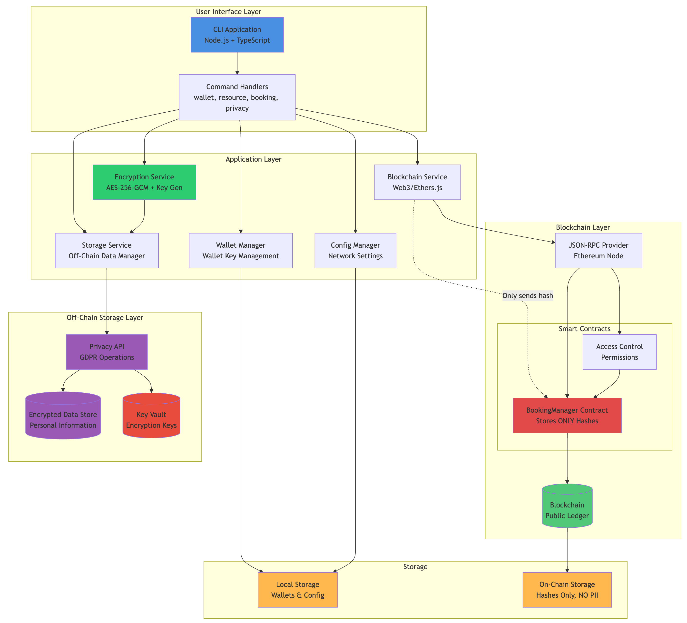

# Blockchain Booking System

> **What if booking systems were transparent, immutable, and privacy-compliant at the same time?**

This proof-of-concept explores how could one go about creating a booking system based on blockchain proposing a hybrid architecture to: **maintaining blockchain's immutability while respecting users' "right to be forgotten."**.

## The Idea

Before all, this is an architectural / engineering exercise, so we can think out-of-the-box, and bring some philosophical ideas from web3.0 as well as great technologies available out there, and possibly get some nice outcomes.

In the exercise we consider these drawbacks from "traditional" booking platforms:

- ❌ Central point of failure and control (you may still have a distributed system, but it is still bounded to a given company)
- ❌ No user ownership of booking records
- ❌ Disputes resolved by intermediaries

Bringing:

> **An effective decentralized system where users own their data, where the system is transparent and traceable, while still offering privacy capabilities.**

## The Solution

Explore our complete architecture through these diagrams:

### 🏗️ Core System Design

- **[System Architecture](diagrams/01-system-architecture.md)** - Complete system with privacy layers
- **[Smart Contract Structure](diagrams/03-smart-contract-structure.md)** - On-chain & off-chain components
- **[Technology Stack](diagrams/08-technology-stack.md)** - All technologies used

### 🔐 Privacy & Security

- **[Data Privacy Architecture](diagrams/11-data-privacy-architecture.md)** - How we separate public and private data
- **[Privacy & Encryption Flow](diagrams/12-privacy-encryption-flow.md)** - Complete encryption process
- **[GDPR "Right to Be Forgotten"](diagrams/10-gdpr-right-to-be-forgotten.md)** - How data deletion works
- **[Security Model](diagrams/07-security-model.md)** - Security layers and access control

### 👤 User Experience

- **[Booking Flow](diagrams/02-booking-flow-sequence.md)** - Privacy-preserving booking creation
- **[User Journey](diagrams/04-user-journey.md)** - Complete user experience flow
- **[Data Flow](diagrams/05-data-flow.md)** - How data moves through the system
- **[State Transitions](diagrams/09-state-transitions.md)** - Booking lifecycle

### 🚀 Deployment

- **[Deployment Architecture](diagrams/06-deployment-architecture.md)** - Dev, test, and production environments

## Key Features

✅ **Privacy-First Design** - Personal data never touches the blockchain  
✅ **GDPR Compliant** - "Right to be forgotten" through cryptographic deletion  
✅ **Transparent** - All booking logic in public smart contracts  
✅ **Immutable** - Booking records can't be altered or censored  
✅ **Decentralized** - No single point of control or failure  
✅ **Cryptographically Secure** - AES-256-GCM encryption + SHA-256 hashing

## Technology Stack

**Blockchain:** Ethereum (Solidity 0.8+)  
**Encryption:** AES-256-GCM, SHA-256  
**Off-Chain Storage:** PostgreSQL/MongoDB/IPFS  
**CLI:** Node.js + TypeScript  
**Smart Contracts:** Hardhat + OpenZeppelin

## How It Works

1. **User books a resource** → Personal data encrypted with unique keys
2. **Encrypted data stored off-chain** → Keys stored separately
3. **Only cryptographic hash sent to blockchain** → No personal data exposed
4. **Smart contract validates and records** → Immutable booking record
5. **User can retrieve data** → Decryption with their keys
6. **User can delete data (GDPR)** → Keys deleted, data irretrievable

**The Magic:** The blockchain hash proves the booking exists, but without the encryption keys (which can be deleted), it reveals nothing about the user.

## Scope: What's Included (and What's Not)

This POC focuses exclusively on the **core booking mechanism** and privacy architecture. The underlying business domains are intentionally excluded.

## Next Steps

**POC Implementation:**

- Smart contracts with privacy-preserving hash storage
- Off-chain encrypted storage with separate key management
- CLI application with booking and GDPR compliance commands
- Testnet deployment and validation

## The Vision

- 🔒 Your personal data is truly yours, deletable on demand
- ⚖️ Disputes are resolved by code, not customer service
- 🚫 No platform can de-platform you or freeze your bookings
- 🔍 Everything is auditable, but your privacy is protected

---

_"What if we reimagined booking systems from first principles, with privacy and transparency as core features, not afterthoughts?"_
