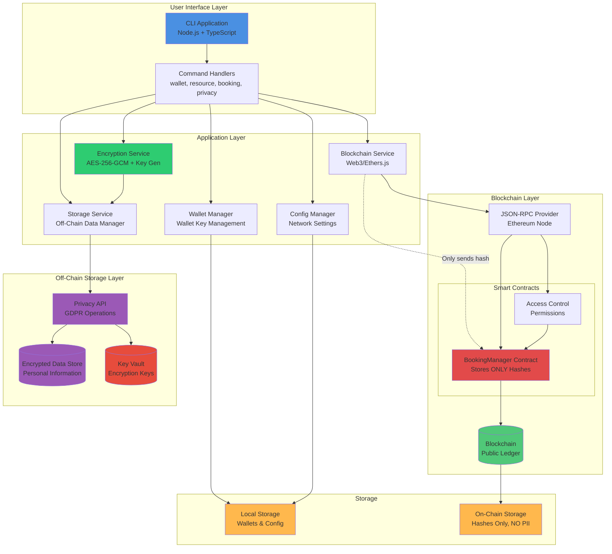

# System Architecture Diagram

## Description

Shows the complete system architecture with privacy layers:

- **User Interface Layer**: CLI application with privacy command handlers
- **Application Layer**: Business logic, blockchain interaction, and encryption services
- **Blockchain Layer**: Smart contracts storing only cryptographic hashes
- **Off-Chain Storage Layer**: Encrypted personal data storage with separate key management

**Key Privacy Features:**

- Personal data never reaches the blockchain
- Encryption keys stored separately from encrypted data
- Privacy API handles GDPR operations
