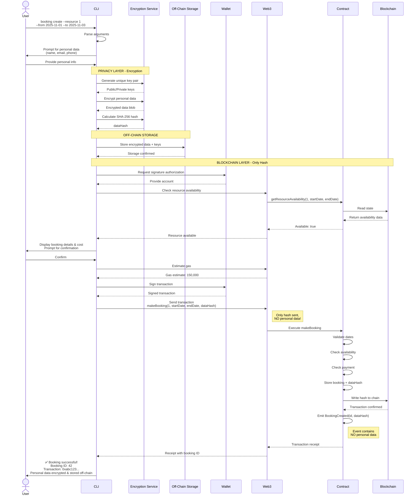

# Privacy-Preserving Booking Flow Sequence Diagram

## Description

Illustrates the complete privacy-preserving flow when a user makes a booking:

1. Personal data collected from user
2. Data encrypted with unique key pair
3. Hash calculated from encrypted data
4. Encrypted data stored off-chain
5. Only hash sent to blockchain
6. No personal data in blockchain events
