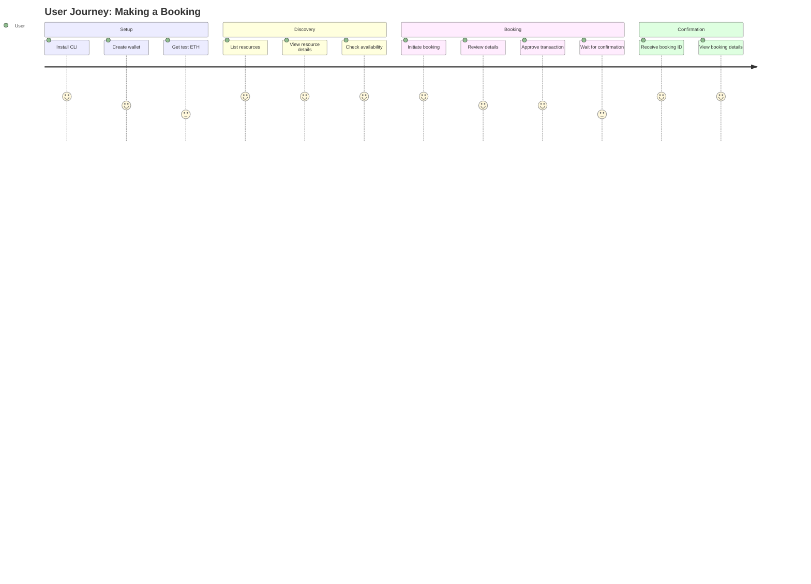

# User Journey - Making a Booking

```mermaid
journey
    title User Journey: Making a Booking
    section Setup
      Install CLI: 5: User
      Create wallet: 4: User
      Get test ETH: 3: User
    section Discovery
      List resources: 5: User
      View resource details: 5: User
      Check availability: 5: User
    section Booking
      Initiate booking: 5: User
      Review details: 4: User
      Approve transaction: 4: User
      Wait for confirmation: 3: User
    section Confirmation
      Receive booking ID: 5: User
      View booking details: 5: User
```

## Description

Maps the emotional journey and steps a user takes from setup to confirmation.
