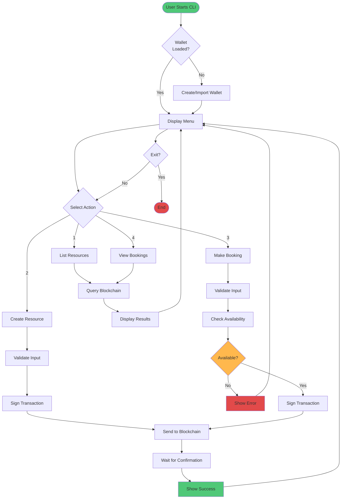

# Data Flow Diagram

```mermaid
flowchart TD
    Start([User Starts CLI]) --> Auth{Wallet<br/>Loaded?}
    Auth -->|No| CreateWallet[Create/Import Wallet]
    Auth -->|Yes| Menu[Display Menu]
    CreateWallet --> Menu

    Menu --> Action{Select Action}

    Action -->|1| ListRes[List Resources]
    Action -->|2| CreateRes[Create Resource]
    Action -->|3| MakeBook[Make Booking]
    Action -->|4| ViewBook[View Bookings]

    ListRes --> QueryChain[Query Blockchain]
    CreateRes --> ValidateInput1[Validate Input]
    MakeBook --> ValidateInput2[Validate Input]
    ViewBook --> QueryChain

    QueryChain --> DisplayResult[Display Results]
    DisplayResult --> Menu

    ValidateInput1 --> SignTx1[Sign Transaction]
    ValidateInput2 --> CheckAvail[Check Availability]

    CheckAvail --> Available{Available?}
    Available -->|No| ShowError[Show Error]
    Available -->|Yes| SignTx2[Sign Transaction]

    SignTx1 --> SendTx[Send to Blockchain]
    SignTx2 --> SendTx

    SendTx --> WaitConfirm[Wait for Confirmation]
    WaitConfirm --> ShowSuccess[Show Success]

    ShowError --> Menu
    ShowSuccess --> Menu

    Menu --> Exit{Exit?}
    Exit -->|No| Action
    Exit -->|Yes| End([End])

    style Start fill:#50C878
    style End fill:#E24A4A
    style Available fill:#FFB84D
    style ShowSuccess fill:#50C878
    style ShowError fill:#E24A4A
```

## Description

Shows how data flows through the system for different user actions.
