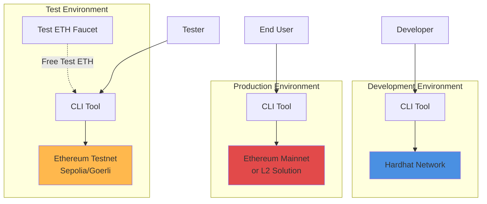

# Deployment Architecture

```mermaid
graph TB
    subgraph "Development Environment"
        DevCLI[CLI Tool]
        Hardhat[Hardhat Network]
        DevCLI --> Hardhat
    end

    subgraph "Test Environment"
        TestCLI[CLI Tool]
        Testnet[Ethereum Testnet<br/>Sepolia/Goerli]
        Faucet[Test ETH Faucet]
        TestCLI --> Testnet
        Faucet -.->|Free Test ETH| TestCLI
    end

    subgraph "Production Environment"
        ProdCLI[CLI Tool]
        Mainnet[Ethereum Mainnet<br/>or L2 Solution]
        ProdCLI --> Mainnet
    end

    Dev[Developer] --> DevCLI
    Tester[Tester] --> TestCLI
    EndUser[End User] --> ProdCLI

    style Hardhat fill:#4A90E2
    style Testnet fill:#FFB84D
    style Mainnet fill:#E24A4A
```

## Description

Illustrates different deployment environments from development to production.
