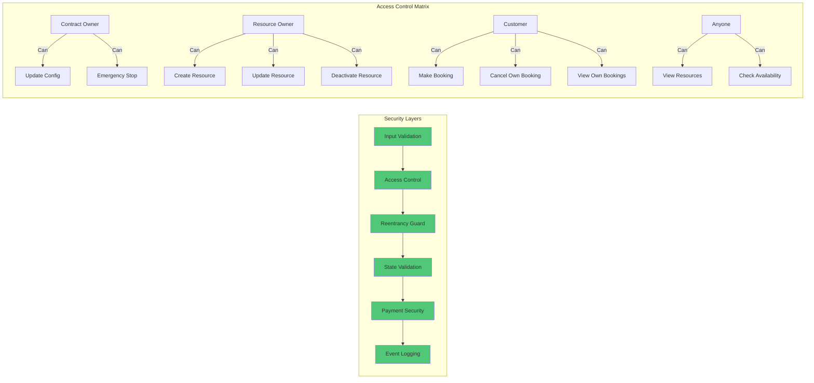

# Security Model

```mermaid
graph LR
    subgraph "Security Layers"
        A[Input Validation] --> B[Access Control]
        B --> C[Reentrancy Guard]
        C --> D[State Validation]
        D --> E[Payment Security]
        E --> F[Event Logging]
    end

    subgraph "Access Control Matrix"
        Owner[Contract Owner] -->|Can| OA[Update Config]
        Owner -->|Can| OB[Emergency Stop]

        ResOwner[Resource Owner] -->|Can| RA[Create Resource]
        ResOwner -->|Can| RB[Update Resource]
        ResOwner -->|Can| RC[Deactivate Resource]

        Customer[Customer] -->|Can| CA[Make Booking]
        Customer -->|Can| CB[Cancel Own Booking]
        Customer -->|Can| CC[View Own Bookings]

        Anyone[Anyone] -->|Can| AA[View Resources]
        Anyone -->|Can| AB[Check Availability]
    end

    style A fill:#50C878
    style B fill:#50C878
    style C fill:#50C878
    style D fill:#50C878
    style E fill:#50C878
    style F fill:#50C878
```

## Description

Visualizes security layers and access control permissions.
