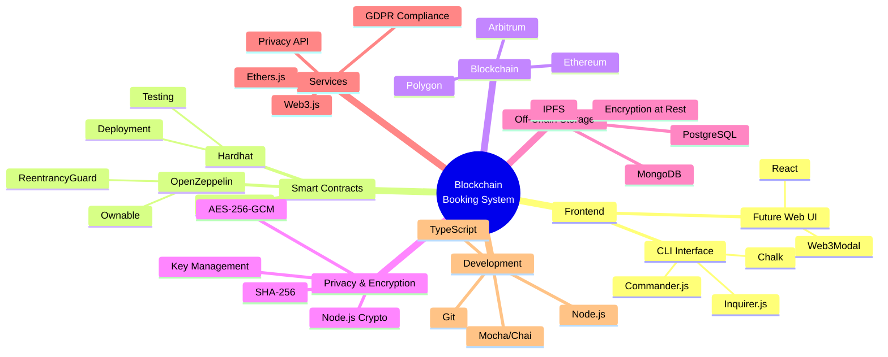

# Technology Stack Overview

```mermaid
mindmap
  root((Blockchain<br/>Booking System))
    Frontend
      CLI Interface
        Commander.js
        Inquirer.js
        Chalk
      Future Web UI
        React
        Web3Modal
    Smart Contracts
      Solidity 0.8+
      OpenZeppelin
        Ownable
        ReentrancyGuard
      Hardhat
        Testing
        Deployment
    Blockchain
      Ethereum
      Polygon
      Arbitrum
    Privacy & Encryption
      AES-256-GCM
      SHA-256
      Node.js Crypto
      Key Management
    Off-Chain Storage
      PostgreSQL
      MongoDB
      IPFS
      Encryption at Rest
    Services
      Web3.js
      Ethers.js
      Privacy API
      GDPR Compliance
    Development
      TypeScript
      Node.js
      Git
      Mocha/Chai
```

## Description

Mind map of all technologies including privacy and encryption components.
