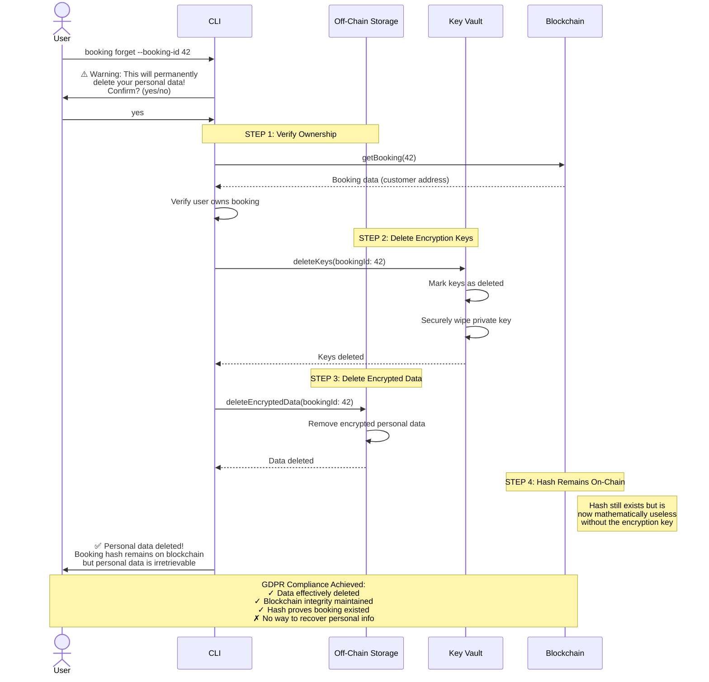

# GDPR "Right to Be Forgotten" Flow

## Description

Demonstrates how personal data deletion works:

1. User requests deletion
2. System verifies ownership
3. Encryption keys are securely wiped
4. Encrypted data is deleted
5. On-chain hash remains but becomes useless
6. GDPR compliance achieved while maintaining blockchain integrity
