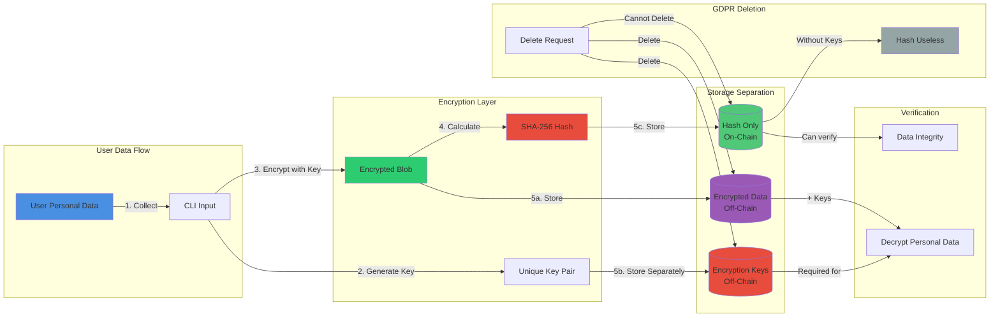

# Data Privacy Architecture

## Description

Shows the separation of concerns:

- Personal data → Encrypted → Stored off-chain
- Encryption keys → Stored separately off-chain
- Hash → Stored on-chain
- GDPR deletion makes hash useless without keys
