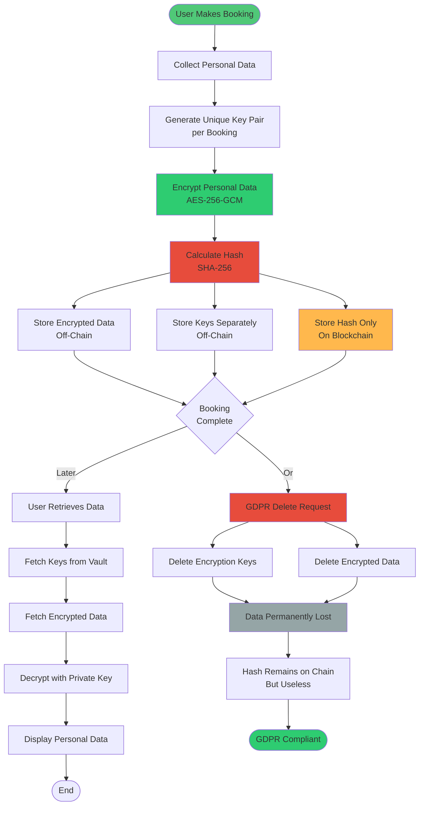

# Privacy & Encryption Flow

## Description

Complete flowchart showing:

- Booking creation with encryption
- Data retrieval with decryption
- GDPR deletion process
- How hash becomes useless after key deletion
